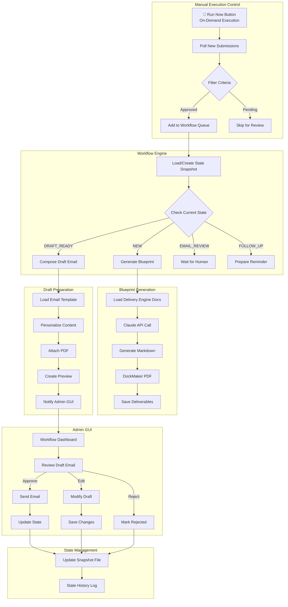
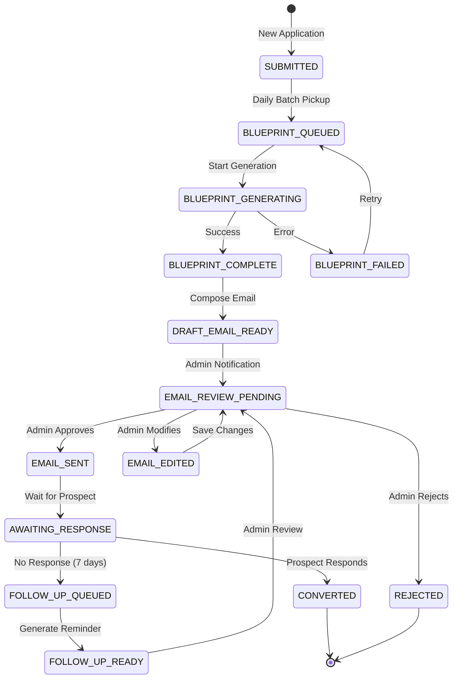

# Workflow Automation Architecture

## Executive Summary

This document outlines a GUI-based workflow automation system for the WavelaunchOS submission-to-delivery pipeline. The system runs locally on macOS with a manual "Run Now" button for on-demand execution, automatically generates business blueprints using delivery-engine documentation, prepares draft emails for manual review, and maintains comprehensive state tracking with explicit human approval checkpoints. The admin interface requires no authentication, providing immediate access for local laptop users.

## Core Requirements Understanding

### Workflow Characteristics
- **Processing Model**: On-demand execution via "Run Now" button in local GUI
- **Authentication**: No login required - direct access for local laptop users
- **Human Oversight**: Draft emails prepared for manual review; NO automatic dispatch
- **State Management**: Persistent snapshot files tracking each creator's pipeline progress
- **Approval Gates**: Explicit human checkpoints at critical workflow stages
- **Blueprint Generation**: Uses delivery-engine docs + Claude Projects specifications
- **PDF Generation**: Integrates with existing DockMaker tool
- **Environment**: Runs locally on macOS

### Delivery Engine Documentation
1. **Wavelaunch_Industry_Frameworks.md** - Industry-specific frameworks for:
   - Fashion/Apparel
   - Beauty/Skincare
   - Wellness/Fitness
   - Education/Coaching
   - Food/Culinary

2. **Wavelaunch_Project_Instructions_OPTIMIZED.md** - Business plan structure:
   - 10 sections (Executive Summary through Success Metrics)
   - Quality standards and research requirements
   - Industry-specific adaptations
   - Output format specifications

3. **DockMaker Tool** - PDF generation from markdown:
   - Input: Markdown business plan
   - Output: Professional PDF with BCG-meets-Apple aesthetic
   - Usage: `python3 md_to_pdf.py input.md output.pdf`

## System Architecture



## Workflow State Machine



## Database Schema Extensions

### New Tables

```sql
-- Workflow state tracking
model WorkflowState {
  id              String   @id @default(cuid())
  applicationId   String   @unique
  application     Application @relation(fields: [applicationId], references: [id])
  
  -- Current state in workflow
  status          WorkflowStatus @default(SUBMITTED)
  statusHistory   Json[]   // Array of {status, timestamp, notes}
  
  -- Blueprint generation
  blueprintMarkdown String?  // Generated markdown content
  blueprintPdfPath  String?  // Path to generated PDF
  generationStartedAt DateTime?
  generationCompletedAt DateTime?
  generationError   String?
  
  -- Email workflow
  draftEmailSubject String?
  draftEmailBody    String?
  draftEmailPreparedAt DateTime?
  emailSentAt       DateTime?
  emailSentBy       String?  // Admin user ID
  
  -- Follow-up tracking
  followUpCount     Int      @default(0)
  lastFollowUpAt    DateTime?
  nextFollowUpAt    DateTime?
  
  -- Snapshot file reference
  snapshotFilePath  String?
  snapshotVersion   Int      @default(1)
  
  -- Timestamps
  createdAt         DateTime @default(now())
  updatedAt         DateTime @updatedAt
  
  @@index([status])
  @@index([nextFollowUpAt])
  @@map("workflow_states")
}

-- Workflow audit log
model WorkflowAuditLog {
  id          String   @id @default(cuid())
  workflowId  String
  action      String   // GENERATE_BLUEPRINT, PREPARE_EMAIL, SEND_EMAIL, etc.
  performedBy String?  // User ID or 'SYSTEM'
  oldStatus   String?
  newStatus   String?
  metadata    Json?    // Additional context
  createdAt   DateTime @default(now())
  
  @@index([workflowId])
  @@index([createdAt])
  @@map("workflow_audit_logs")
}

-- Email draft storage
model EmailDraft {
  id              String   @id @default(cuid())
  workflowId      String   @unique
  subject         String
  body            String
  attachments     Json[]   // Array of {filename, path, mimeType}
  
  -- Review status
  status          DraftStatus @default(PENDING_REVIEW)
  reviewedBy      String?
  reviewedAt      DateTime?
  reviewNotes     String?
  
  -- Send tracking
  sentAt          DateTime?
  sentBy          String?
  
  createdAt       DateTime @default(now())
  updatedAt       DateTime @updatedAt
  
  @@index([status])
  @@map("email_drafts")
}

-- Daily batch job logs
model BatchJobLog {
  id            String   @id @default(cuid())
  jobType       String   // DAILY_POLL, BLUEPRINT_GENERATION, etc.
  startedAt     DateTime
  completedAt   DateTime?
  status        String   // RUNNING, COMPLETED, FAILED
  itemsProcessed Int     @default(0)
  itemsFailed   Int      @default(0)
  errorMessage  String?
  logData       Json?    // Detailed processing log
  
  @@index([startedAt])
  @@map("batch_job_logs")
}

-- Enums
enum WorkflowStatus {
  SUBMITTED
  BLUEPRINT_QUEUED
  BLUEPRINT_GENERATING
  BLUEPRINT_COMPLETE
  BLUEPRINT_FAILED
  DRAFT_EMAIL_READY
  EMAIL_REVIEW_PENDING
  EMAIL_EDITED
  EMAIL_SENT
  AWAITING_RESPONSE
  FOLLOW_UP_QUEUED
  FOLLOW_UP_READY
  CONVERTED
  REJECTED
  ARCHIVED
}

enum DraftStatus {
  PENDING_REVIEW
  APPROVED
  REJECTED
  SENT
  MODIFIED
}
```

## Component Specifications

### 1. Manual Workflow Processor

**Trigger**: "Run Now" button in local GUI (on-demand execution)

**Process**:
1. User clicks "Run Now" button on dashboard
2. Query applications with status = 'APPROVED' and no workflow state
3. For each application:
   - Generate blueprint using Claude + DockMaker
   - Compose draft email
   - Save to review queue
4. Update execution log with results
5. Display completion summary to user

**Implementation**:
```typescript
// src/lib/workflow/manual-processor.ts
export class ManualWorkflowProcessor {
  async executeWorkflow(): Promise<WorkflowResult> {
    const executionLog = await this.createExecutionLog();
    const results: ProcessingResult[] = [];
    
    try {
      // Find approved applications without workflow state
      const pendingApps = await prisma.application.findMany({
        where: {
          status: 'APPROVED',
          workflowState: null
        }
      });
      
      // Process each application through pipeline
      for (const app of pendingApps) {
        try {
          const result = await this.processApplication(app);
          results.push({ appId: app.id, status: 'success', result });
        } catch (error) {
          results.push({ appId: app.id, status: 'error', error: error.message });
        }
      }
      
      await this.completeExecutionLog(executionLog, results);
      return {
        success: true,
        processed: results.filter(r => r.status === 'success').length,
        failed: results.filter(r => r.status === 'error').length,
        details: results
      };
    } catch (error) {
      await this.failExecutionLog(executionLog, error);
      throw error;
    }
  }
  
  private async processApplication(app: Application): Promise<ProcessingResult> {
    // Step 1: Create workflow state
    const workflowState = await this.createWorkflowState(app);
    
    // Step 2: Generate blueprint
    const blueprint = await this.generateBlueprint(app);
    
    // Step 3: Convert to PDF using DockMaker
    const pdfPath = await this.convertToPdf(blueprint);
    
    // Step 4: Compose draft email
    const draftEmail = await this.composeDraftEmail(app, pdfPath);
    
    // Step 5: Update state to ready for review
    await this.updateWorkflowState(workflowState.id, {
      status: 'EMAIL_REVIEW_PENDING',
      blueprintMarkdown: blueprint,
      blueprintPdfPath: pdfPath,
      draftEmailSubject: draftEmail.subject,
      draftEmailBody: draftEmail.body
    });
    
    return { workflowStateId: workflowState.id, status: 'EMAIL_REVIEW_PENDING' };
  }
}
```

**GUI Button Component**:
```typescript
// "Run Now" button with progress feedback
<Button
  onClick={executeWorkflow}
  disabled={isProcessing}
  size="lg"
  className="bg-green-600 hover:bg-green-700"
>
  {isProcessing ? (
    <>
      <Loader2 className="mr-2 h-5 w-5 animate-spin" />
      Processing {progress.current} of {progress.total}...
    </>
  ) : (
    <>
      <Play className="mr-2 h-5 w-5" />
      Run Now
    </>
  )}
</Button>
```

### 2. Blueprint Generation Service

**Process**:
1. Load delivery-engine documentation
2. Load application data
3. Call Claude API with structured prompt
4. Generate markdown business plan
5. Call DockMaker to convert to PDF
6. Save deliverables and update state

**Claude Prompt Structure**:
```
You are a senior strategic consultant at Wavelaunch Studio...

INDUSTRY FRAMEWORK: [Load from Wavelaunch_Industry_Frameworks.md based on industryNiche]

PROJECT INSTRUCTIONS: [Load from Wavelaunch_Project_Instructions_OPTIMIZED.md]

CREATOR DATA:
[Full application form data]

OUTPUT: Generate a comprehensive business blueprint following the 10-section structure.
```

**DockMaker Integration**:
```typescript
// src/lib/workflow/pdf-generator.ts
export class PdfGenerator {
  async generateFromMarkdown(markdown: string, outputPath: string): Promise<string> {
    // Write markdown to temp file
    const tempMdPath = `/tmp/${uuid()}.md`;
    await fs.writeFile(tempMdPath, markdown);
    
    // Call DockMaker
    const dockMakerPath = 'delivery-engine/DockMaker/md_to_pdf.py';
    await execAsync(`python3 ${dockMakerPath} ${tempMdPath} ${outputPath}`);
    
    // Cleanup temp file
    await fs.unlink(tempMdPath);
    
    return outputPath;
  }
}
```

### 3. Email Draft Composer

**Process**:
1. Load email template
2. Personalize with creator data
3. Attach PDF blueprint
4. Create preview for admin review
5. Set status to EMAIL_REVIEW_PENDING

**Email Template Structure**:
```html
Subject: Your Custom Business Blueprint from Wavelaunch Studio

Hi {{creatorName}},

We've analyzed your application and created a comprehensive business blueprint for {{productName}}.

[Personalized opening based on their vision]

Your blueprint includes:
- Market analysis and competitive positioning
- Product strategy and roadmap
- Financial projections and unit economics
- Go-to-market strategy
- Implementation timeline

[CTA for next steps - discovery call, LOI, etc.]

Best regards,
Wavelaunch Studio Team

Attachment: {{blueprintFilename}}
```

### 4. Snapshot State Management

**Snapshot File Format** (JSON):
```json
{
  "workflowId": "wf_abc123",
  "applicationId": "app_xyz789",
  "creatorName": "Phoenix Malone",
  "currentState": "EMAIL_REVIEW_PENDING",
  "stateHistory": [
    {
      "status": "SUBMITTED",
      "timestamp": "2026-01-29T09:00:00Z",
      "notes": "Application received"
    },
    {
      "status": "BLUEPRINT_QUEUED",
      "timestamp": "2026-01-29T09:15:00Z",
      "notes": "Added to daily batch"
    },
    {
      "status": "BLUEPRINT_COMPLETE",
      "timestamp": "2026-01-29T09:45:00Z",
      "notes": "Generation successful"
    }
  ],
  "deliverables": {
    "blueprintMarkdown": "/deliverables/phoenix_malone_blueprint.md",
    "blueprintPdf": "/deliverables/phoenix_malone_blueprint.pdf",
    "generatedAt": "2026-01-29T09:45:00Z"
  },
  "emailDraft": {
    "subject": "Your Custom Business Blueprint...",
    "preparedAt": "2026-01-29T10:00:00Z",
    "status": "PENDING_REVIEW"
  },
  "followUps": {
    "count": 0,
    "schedule": []
  },
  "metadata": {
    "version": 1,
    "lastUpdated": "2026-01-29T10:00:00Z",
    "updatedBy": "SYSTEM"
  }
}
```

**Storage Location**: `data/workflow-snapshots/{applicationId}.json`

### 5. Local GUI Dashboard (No Authentication)

**Access**: Direct access at `http://localhost:3000/workflow` - no login required for local laptop use

**Pages**:

#### Workflow Dashboard (`/workflow`)
- **🚀 Run Now Button** - Execute workflow on-demand with progress indicator
- Pipeline overview with status counts (visual dashboard)
- Recent activity feed showing last execution
- Failed items requiring attention
- Manual execution history

#### Review Queue (`/workflow/review`)
- List of emails pending review with creator info
- Preview pane with draft subject/body
- One-click approve/reject/edit actions
- PDF attachment preview/download

#### Creator Detail (`/workflow/creator/{id}`)
- Complete state history timeline
- Snapshot file JSON viewer
- Blueprint markdown preview
- Generated PDF download
- Email thread history
- Manual state override controls

#### Execution Log (`/workflow/logs`)
- Manual execution history with timestamps
- Processing results summary
- Failed items with retry option
- Detailed error messages

**No Authentication Required**: Since this runs locally on macOS, the GUI is accessible without any login or authentication checks.

## Implementation Phases

### Phase 1: Foundation (Week 1-2)
- Database schema migrations
- Workflow state machine implementation
- Batch processor skeleton
- Snapshot file management

### Phase 2: Blueprint Generation (Week 3-4)
- Claude API integration
- Delivery-engine doc loading
- DockMaker integration
- Markdown to PDF pipeline

### Phase 3: Email Workflow (Week 5-6)
- Email draft composer
- Template system
- Admin review GUI
- Manual send integration

### Phase 4: Dashboard & Monitoring (Week 7-8)
- Admin GUI dashboard
- Workflow visualization
- Batch job monitoring
- State history viewer

### Phase 5: Testing & Optimization (Week 9-10)
- End-to-end testing
- Error handling refinement
- Performance optimization
- Documentation

## Error Handling & Retry Logic

### Blueprint Generation Failures
- **Retry**: 3 attempts with exponential backoff
- **Fallback**: Queue for manual review
- **Alert**: Notify admin on persistent failure

### PDF Generation Failures
- **Retry**: 2 attempts
- **Fallback**: Store markdown only, flag for manual PDF generation

### Email Draft Failures
- **Retry**: 2 attempts
- **Fallback**: Queue for manual composition

### State Management
- **Backup**: Snapshots backed up to S3 daily
- **Recovery**: Ability to rebuild state from audit logs
- **Consistency**: Database + file system sync checks

## Security & Access Control

- **API Keys**: Claude API key stored in environment variables
- **File Access**: Deliverables stored outside web root
- **Admin Auth**: Requires ADMIN role for workflow GUI
- **Audit Trail**: All state changes logged with user attribution

## Configuration

```env
# Workflow Automation
WORKFLOW_BATCH_SCHEDULE=0 9 * * *  # Daily at 9 AM
WORKFLOW_RETRY_MAX_ATTEMPTS=3
WORKFLOW_RETRY_DELAY_MS=60000

# Claude API
ANTHROPIC_API_KEY=sk-...
CLAUDE_MODEL=claude-3-opus-20240229

# DockMaker
DOCKMAKER_PATH=delivery-engine/DockMaker/md_to_pdf.py
DOCKMAKER_TIMEOUT_MS=300000

# Snapshots
SNAPSHOT_BASE_PATH=data/workflow-snapshots
SNAPSHOT_BACKUP_ENABLED=true

# Email
EMAIL_DRAFT_FROM=noreply@wavelaunch.studio
EMAIL_REVIEW_NOTIFICATION=true
```

## Success Metrics

- **Throughput**: Applications processed per batch
- **Generation Time**: Average blueprint generation duration
- **Review Time**: Average time from draft ready to email sent
- **Conversion Rate**: Applications → Converted clients
- **Error Rate**: Failed operations percentage
- **Admin Time Saved**: Hours saved vs. manual process

## Next Steps

1. Review and approve architecture design
2. Switch to Code mode for implementation
3. Create database migrations
4. Implement batch processor
5. Build blueprint generation service
6. Develop admin GUI dashboard
